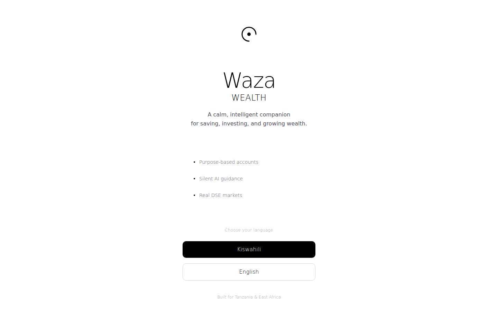

# Waza Wealth

**An investing and financial-literacy app for first-time investors — an AI wealth copilot, cross-market portfolio tracking, and habit-building tools to make investing approachable.**


## What this is

Waza ("waza" — Swahili for idea/think) is a fintech app aimed at making investing approachable for first-time investors, combining an AI tutor/wealth copilot, cross-market portfolio views, a trading screen, and gamified habit-building elements (daily rituals, badges, activity rings). Supabase integration is present.



## Status: In active development

The codebase currently contains several parallel dashboard design explorations (e.g. "Calm," "Apple-style," "Wealthsimple-style" variants) rather than one finalized UI — a design direction needs to be picked before this is demo-ready. No live market/brokerage data integration has been verified yet.

### Roadmap
- Consolidate to a single dashboard direction
- Verify/replace any mocked market data with a real feed
- Regulatory review before any real trading-adjacent features ship (investment apps carry compliance obligations)

## Quickstart

```bash
npm i
npm run dev
```

## Folder overview

- `src/app/components/` — dashboard variants, AI tutor/copilot, portfolio and trading screens
- `src/utils/supabase/` — Supabase client setup

## Contributing

See the [org-wide CONTRIBUTING.md](https://github.com/creova-gif/.github/blob/main/CONTRIBUTING.md) for guidelines, including our AI-assisted contribution policy.

## License

Proprietary — © CREOVA. All rights reserved.
